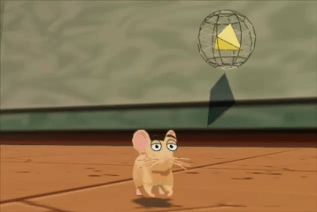

# vibejam2026


[Play Mouse Trouble](https://mouse.ryanfitzpatrick.io/)

Mouse Trouble is a multiplayer kitchen-stealth game built with Vite and Three.js. You play a mouse in a stylized kitchen, move through the room with server-authoritative networking, and interact with a level that can be edited locally in build mode.

The project includes:
- A rigged mouse character with baked animation clips and an animated eye atlas.
- A kitchen level built from editable JSON primitives, prefabs, and texture-atlas surfaces.
- Client prediction, server reconciliation, and remote player interpolation.
- A dev-only build mode for grid-snapped level editing and prefab authoring.
- WebGL rendering (outlines via post-processing on the WebGL path).

## Development

```bash
npm install
npm run dev
```

For local multiplayer, the PartyKit server is in `party/server.js` and the client connects through `VITE_PARTYKIT_HOST`.

## Build

```bash
npm run build
```

The build pipeline also generates optimized runtime assets:
- `assets/source/mouse-skinned.glb` is combined from the rigged mouse and skin source.
- `public/mouse-skinned.optimized.glb` is compressed for production.
- `public/textures.optimized.webp` and `public/eyeset1.optimized.webp` are generated from the source atlases.

## Deploy

This is a static Vite app. Cloudflare Pages is the simplest deployment target:

- Build command: `npm run build`
- Build output directory: `dist`

Wrangler is also configured for Workers static assets:

```bash
npm install
npx wrangler login
npm run deploy:cf
```

The Wrangler config lives in [wrangler.jsonc](/Users/personal/source/vibejam2026/wrangler.jsonc) and serves the built `dist` directory with SPA fallback.

The same Worker also owns the aggregate stats API:
- `POST /api/stats/event` accepts signed stat batches from PartyKit.
- `GET /api/stats` returns aggregate stats when called with the admin bearer token.

PartyKit accounts without custom Cloudflare bindings cannot attach KV directly, so production stats flow through this Worker and its `GAME_STATS` KV binding.

## Environment

```bash
VITE_PARTYKIT_HOST=mouse-trouble.username.partykit.dev
ALLOWED_ORIGINS=https://mouse.ryanfitzpatrick.io,http://localhost:5173
```

Production stats require matching secrets on the Cloudflare Worker and PartyKit server:

```bash
npx wrangler secret put STATS_COLLECTOR_TOKEN
npx wrangler secret put STATS_ADMIN_TOKEN
npx partykit env add STATS_COLLECTOR_URL
npx partykit env add STATS_COLLECTOR_TOKEN
npx partykit env add ALLOWED_ORIGINS
```

Set `STATS_COLLECTOR_URL` to the deployed Worker endpoint, for example `https://mouse.ryanfitzpatrick.io/api/stats/event`. Use the same `STATS_COLLECTOR_TOKEN` value in Wrangler and PartyKit.
Set `ALLOWED_ORIGINS` to a comma-separated list of browser origins allowed to open PartyKit WebSockets. Include your production game origin and local Vite origin for dev.

Read stats with bearer auth only:

```bash
curl -H "Authorization: Bearer $STATS_ADMIN_TOKEN" https://mouse.ryanfitzpatrick.io/api/stats
```
